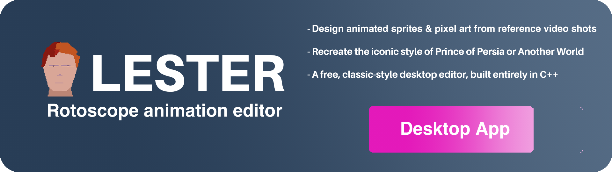
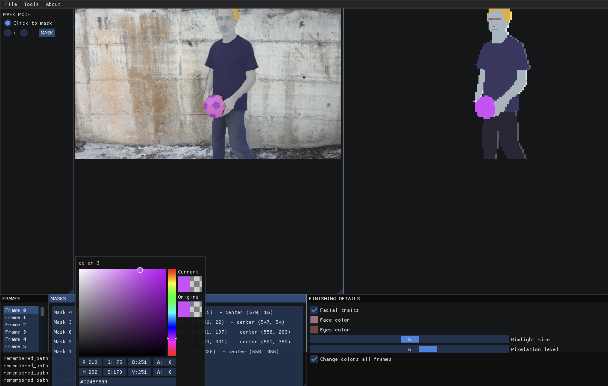

# Lester: Rotoscope Animation & Video Segmentation Editor

  

    
  

## 1. Introduction

Project page: [https://rtous.github.io/lester/](https://rtous.github.io/lester/)

This repository contains the official installers for Lester, the rotoscope animation and video segmentation editor, for macOS and Windows. A free, classic-style desktop editor, built entirely in C++. Download, install, and start creating 2D animations and sprites from reference video shots. Recreate the visual aesthetic of iconic video games from the 80s and 90s, such as Prince of Persia or Another World. The editor can also be used just for pure promptable image or video segmentation. 

    

## 2 Download and install

<!--[MacOS Installer (Apple Silicon)](https://github.com/rtous/lester-release/raw/refs/heads/main/Lester-Installer.dmg?download=).-->

(v0.1.11-alpha. Already usable but not robust and not very user friendly yet.)

[MacOS Installer (Apple Silicon)](https://github.com/rtous/lester/releases/download/v0.1.11-alpha/Lester-Installer.dmg)

<!--
TROUBLESHOOTING: If problems with code signing, after installing the application (and before executing it), open a terminal and run:

	cd /Applications; xattr -cr Lester.app
-->

[Windows Installer (CPU)](https://github.com/rtous/lester/releases/download/v0.1.11-alpha/lester_0_1_11_alpha_windows_CPU.zip)

	- Download
	- Unzip
	- Right-click on Lester.exe, select "Properties", At the bottom, you'll see: "This file came from another computer and might be blocked...". Check the box "Unblock". Click "Apply" then "OK"
	- Double-click the .exe

[Windows Installer (NVIDIA GPU)](https://github.com/rtous/lester/releases/download/v0.1.10-alpha/lester_0_1_10_alpha_windows_GPU.zip)
(same instructions as for CPU)

Number of downloads [here](https://api.github.com/repos/rtous/lester/releases)

## 3 Screenshots

  

      </a>
  

## 4 Research paper

The editor is based on the method created by Ruben Tous and described in the paper [Lester: Rotoscope Animation Through Video Object Segmentation and Tracking](https://www.mdpi.com/1999-4893/17/8/330). The results reported in the paper can be found [here](RESULTS.md). 

If you find this project useful, please cite the original publication:

	@Article{a17080330,
		AUTHOR = {Tous, Ruben},
		TITLE = {Lester: Rotoscope Animation through Video Object Segmentation and Tracking},
		JOURNAL = {Algorithms},
		VOLUME = {17},
		YEAR = {2024},
		NUMBER = {8},
		ARTICLE-NUMBER = {330},
		URL = {https://www.mdpi.com/1999-4893/17/8/330},
		ISSN = {1999-4893},
		DOI = {10.3390/a17080330}
	}

