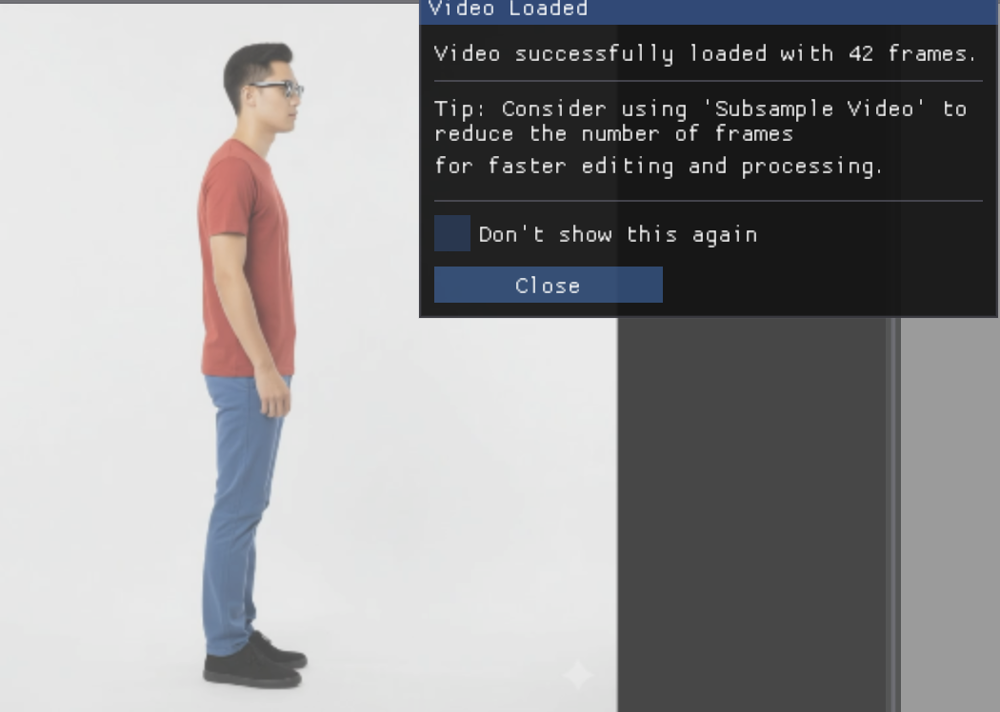
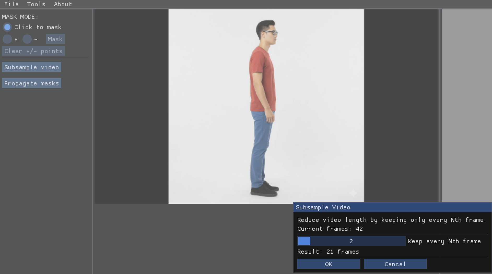
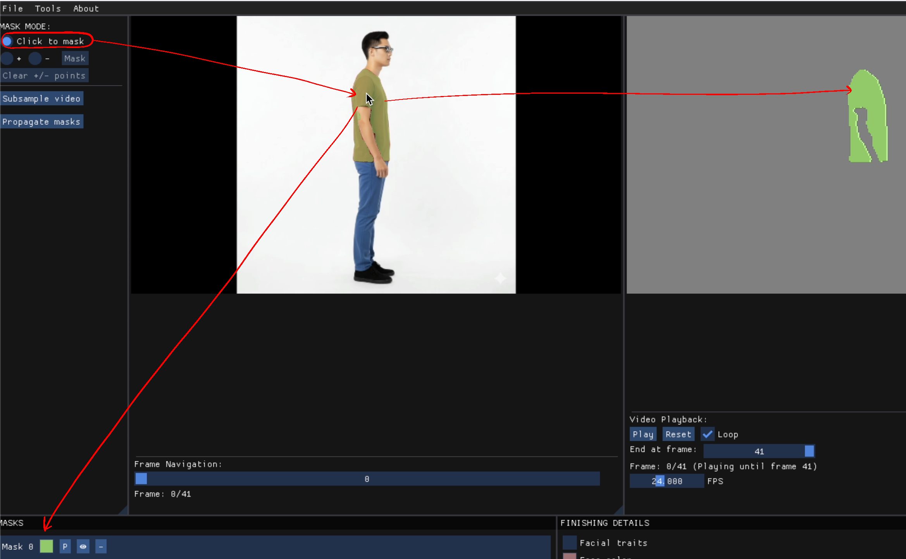
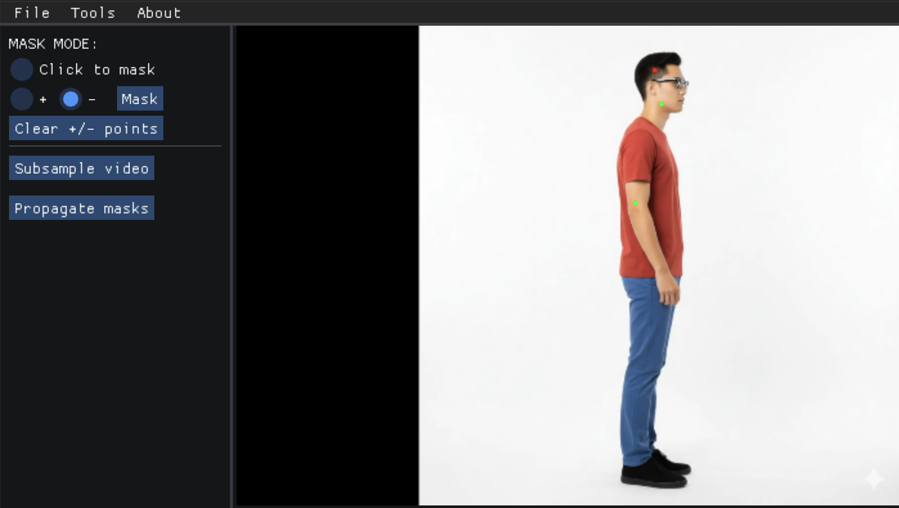
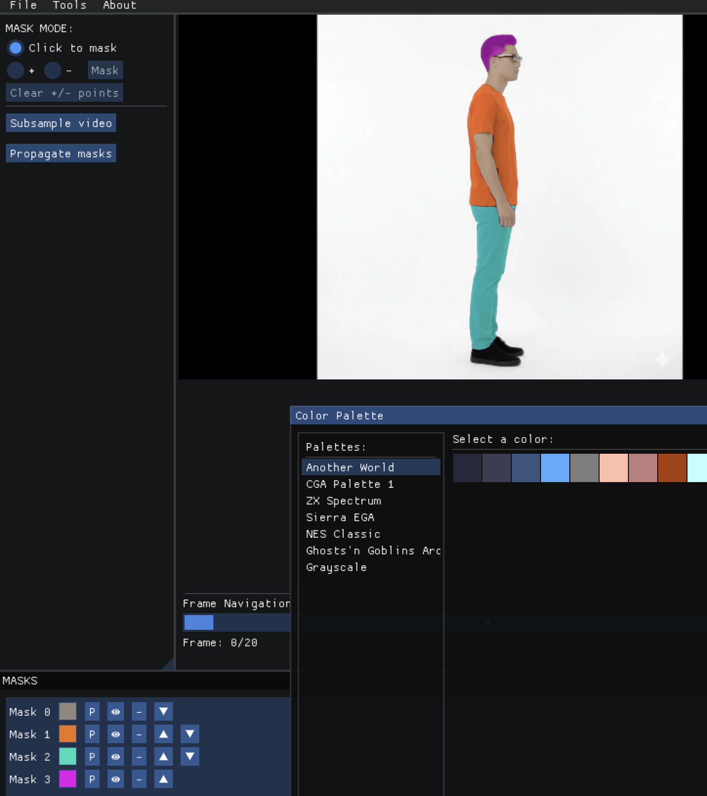

# Lester – User Guide (for version v0.1.11-alpha)

## General functionalty

Lester is a tool for retro-style rotoscoping. The user clicks on the first frame of the video to select various regions (masks)—for example, a hat, a jacket, or skin. These masks are then geometrically simplified to smooth out irregularities and achieve a retro aesthetic. The user can apply different colors and finishing effects, such as rim lighting or pixelation. Finally, the system can automatically propagate the masks across the remaining video frames on request. No tools for manually drawing over the video frames are currently provided, as this is assumed to be handled with an external tool. However, this functionality is planned for future versions.

This guide walks you through the complete workflow.

---

## 1. Loading a Video or Image

The first step is to load a video (`.mp4`) or a still image (`.jpg`, `.png`) through the **File** menu.

<!--  -->

After loading, Lester may show a warning if the video has more than 100 frames, suggesting subsampling to speed up mask propagation.

---

## 2. Optional: Subsample the Video

Reduce the number of frames by clicking:

**Left Panel → Subsample video**

Subsampling:

- Makes propagation faster.
- Makes the animation faster and less realistic due to removed frames.
- Can be compensated later through interpolation, but interpolation is currently experimental.

**Recommendation:** Do not subsample unless your hardware struggles with the full video.

---

## 3. Selecting and Creating Masks

The central panel displays the current frame.  
This is where you define masks.

### 3.1 Click-to-Mask (default mode)

The central panel displays the currently selected video frame. If the click-to-mask radio button is selected on the left panel (it's selected by default), clicking on any area lets the user select a mask, which corresponds to a segmented region of the video. Two mask selection modes are available, with the default being click-to-mask. In this mode, a single click selects a mask, and clicking again on the same mask deselects it. Once a mask is created, it also appears in the right panel, where a preview shows how the final rotoscoped frame will look. The bottom panel contains a list of all created masks, allowing the user to edit or delete them.

- Click an area once → a mask is created.  
- Click again on the same mask → it is deselected.

This mode is ideal for simple, contiguous regions.

---

### 3.2 Multi-Point Mask Mode (+ / –)

Click the **+** or **–** radio buttons to enter multi-point mode.

In this mode:

- Place positive points (belong to mask).  
- Place negative points (must not belong to mask).  
- When ready, press **Mask** to generate the mask.

Useful for complex or discontinuous regions (e.g., visible skin on arms and face).

To delete a mask, use the **– button** in the bottom-left Masks List panel.

---

## 4. Editing Masks: Colors & Order

### 4.1 Changing Colors

Use the **Masks List Panel** (bottom-left):

- Pick custom colors  
- Or use preset palette colors via the **P** button

### 4.2 Ordering Masks

Adjust stacking order via the **up/down arrows**.

---

## 5. Previewing and Adjusting the Retro Style

The right panel shows a live preview of the stylized frame.

In the **Finishing Details** section (bottom-right), you can adjust:

- Rimlight size  
- Pixelation level

These settings can be modified before or after propagation.

---

## 6. Optional: Adding Facial Features

If the video shows a frontal, clearly visible face:

Customize:

- Face color  
- Eyes color  

Facial traits will propagate together with the masks.

---

## 7. Propagating Masks Across the Video

When everything is set:

**Left Panel → Propagate masks**

Lester will ask up to which frame you want to propagate.

Propagation speed depends on:

- number of frames  
- number of masks  
- hardware  

Facial traits (if enabled) are also propagated.

---

## 8. Reviewing the Animation

After propagation:

- The right panel shows the rotoscoped frames.  
- Use playback controls to play, loop, or scrub the animation.

---

## 9. Exporting Your Animation

You may export as:

- `.mp4` video  
- `.png` frames (recommended for transparency, games, GIFs)

When exporting, Lester will ask whether to apply interpolation:

- Useful only if you subsampled earlier  
- Currently experimental

---

## 10. Summary of Best Practices

- Avoid subsampling unless necessary  
- Use multi-point mode for complex masks  
- Reorder masks to prevent overlap  
- Enable facial traits only when the face is frontal  
- Prefer PNG export when transparency matters

